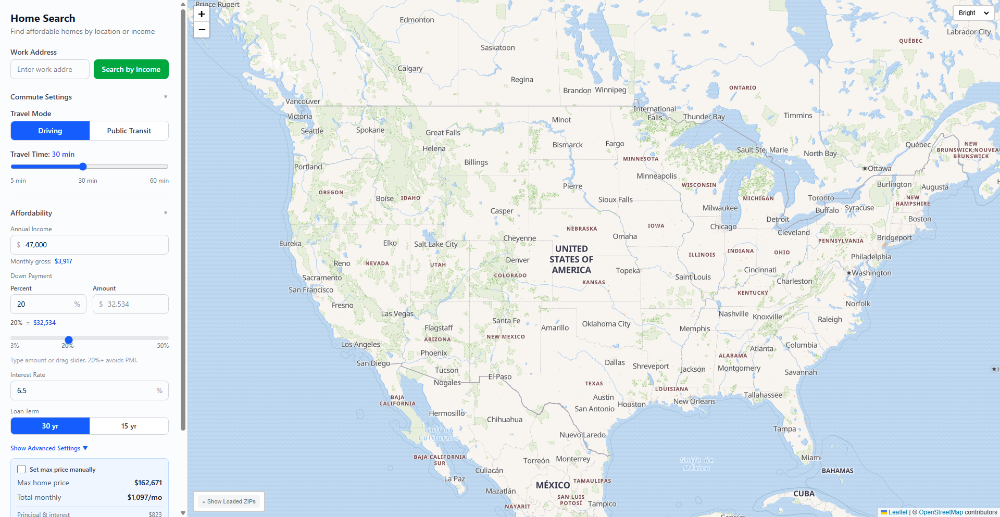
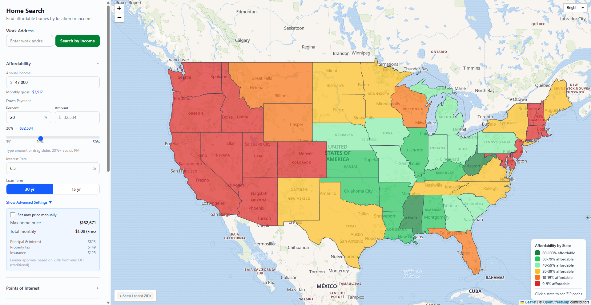

# Housing Affordability Tool

Find affordable homes nationwide based on your income and commute preferences.

**Live Demo:** https://nc1107.github.io/housing-affordability/

## Screenshots

### Income-Based Nationwide Search


### Affordability Choropleth Map


## Features

**Income-Based Search**
- Search affordable housing nationwide based on your annual income
- Interactive state choropleth showing affordability percentages
- Drill down by state to see detailed ZIP-level data
- Color-coded affordability tiers (green = affordable, yellow = stretch, red = unaffordable)

**Commute-Based Search**
- Enter a work address to see housing within your commute zone
- Support for driving and public transit modes
- Adjustable travel time (5-60 minutes)
- Isochrone visualization showing reachable areas

**Affordability Calculator**
- Comprehensive mortgage calculator with customizable parameters
- Down payment percentage or dollar amount input
- Interest rate, loan term, property tax, and insurance settings
- DTI (debt-to-income) ratio calculations for lender approval
- Advanced settings for monthly debts, HOA fees, and discretionary spending

**Housing Data**
- 7.5MB bundled static data - no database required
- Median home values by ZIP (Zillow ZHVI)
- Median market rent by ZIP (Zillow ZORI)
- ZIP code boundaries (ZCTA) for all 50 states
- Updated monthly from Zillow data

**Mobile Responsive**
- Optimized for phone and tablet access
- Collapsible sidebar with touch-friendly controls
- Works offline (except address search)

## Quick Start

1. Clone the repository
   ```bash
   git clone https://github.com/NC1107/housing-affordability.git
   cd housing-affordability
   ```

2. Install dependencies
   ```bash
   npm install
   ```

3. (Optional) Set up Geoapify API key for address search
   ```bash
   cp .env.example .env
   # Add your API key to .env
   ```
   Note: Income-based search works 100% without an API key

4. Run development server
   ```bash
   npm run dev
   ```

5. Open http://localhost:5173

## Tech Stack

- React 18 + Vite 6 + TypeScript 5
- Tailwind CSS 4
- Leaflet 1.9 + React Leaflet 4
- Turf.js for geospatial operations
- APIs: Geoapify (geocoding, isochrones), Census Bureau (ZIP boundaries)

## Data Sources

| Source | Data | Updated |
|--------|------|---------|
| Zillow ZHVI | Median home values by ZIP | Monthly |
| Zillow ZORI | Median market rent by ZIP | Monthly |
| Census Gazetteer | ZIP code centroids (lat/lon) | Decennial |
| Census TIGER/Line | ZIP (ZCTA) boundaries GeoJSON | Annual |

## Deployment

This app is configured for GitHub Pages deployment.

**Build and preview locally:**
```bash
npm run build
npx vite preview
```

The `vite.config.ts` uses conditional base paths:
- Development: `base: '/'` (localhost:5173)
- Production: `base: '/housing-affordability/'` (GitHub Pages)

GitHub Actions automatically builds and deploys on push to `main` branch.

## Updating Housing Data

Refresh housing data with latest Zillow numbers:

```bash
npm run fetch-data
```

This downloads and processes:
- Latest Zillow ZHVI (home values) and ZORI (rents) CSV files
- Census ZIP code centroids
- Generates optimized JSON bundles in `public/data/`

## API Usage

**Geoapify free tier:** 3,000 credits/day

Isochrone cost: approximately `minutes / 5` credits
- 15 min = ~3 credits
- 30 min = ~6 credits
- 60 min = ~12 credits

Income-based search uses zero API credits - only address search requires the API.

## Development

```bash
npm install          # Install dependencies
npm run dev          # Start dev server
npm run build        # Build for production
npm run preview      # Preview production build
```

## License

MIT

## Data Credits

- [Zillow Research](https://www.zillow.com/research/data/) - ZHVI/ZORI housing data
- [US Census Bureau](https://www.census.gov/geographies/mapping-files.html) - ZIP boundaries and centroids
- [Geoapify](https://www.geoapify.com/) - Geocoding and isochrone generation
